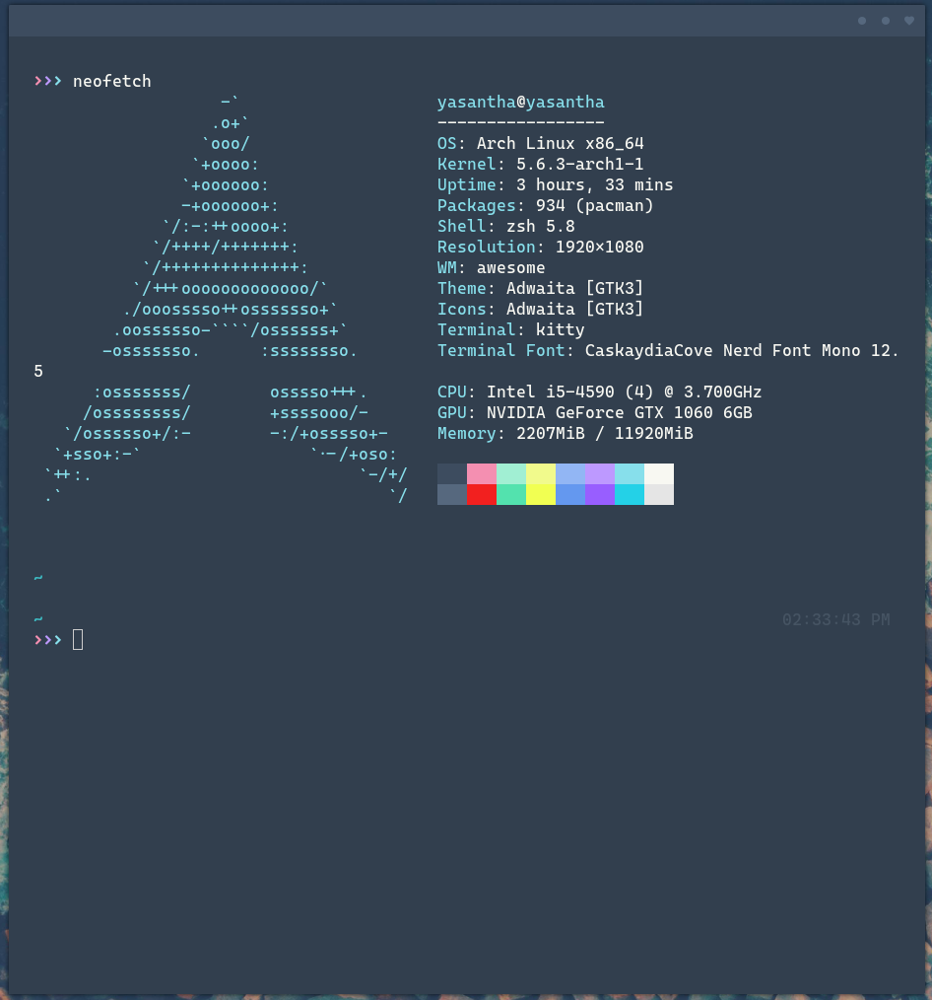

## Setup Details:

+ **WM**: [AwesomeWM](https://github.com/awesomeWM/awesome/)
+ **OS**: Arch Linux
+ **Shell**: [Zsh](https://wiki.archlinux.org/index.php/Zsh)
+ **Terminal**: [Kitty](https://github.com/kovidgoyal/kitty/)
+ **Editor**: [Neovim](https://github.com/neovim/neovim/)
+ **File Manager**: [Ranger](https://wiki.archlinux.org/index.php/Ranger)
+ **Launcher**: [Rofi](https://github.com/davatorium/rofi/)
+ **Compositor**: [Picom](https://github.com/yshui/picom)
+ **Browser**: Firefox

## Awesome Setup:

+ Shamelessly copied everything from great [elenapan](https://github.com/elenapan/dotfiles)
+ Using the [Ephemeral](https://github.com/elenapan/dotfiles/wiki/Gallery) theme

  

## Zsh Setup:

+ Using [powerlevel10k](https://github.com/romkatv/powerlevel10k) with customized pure theme

  

